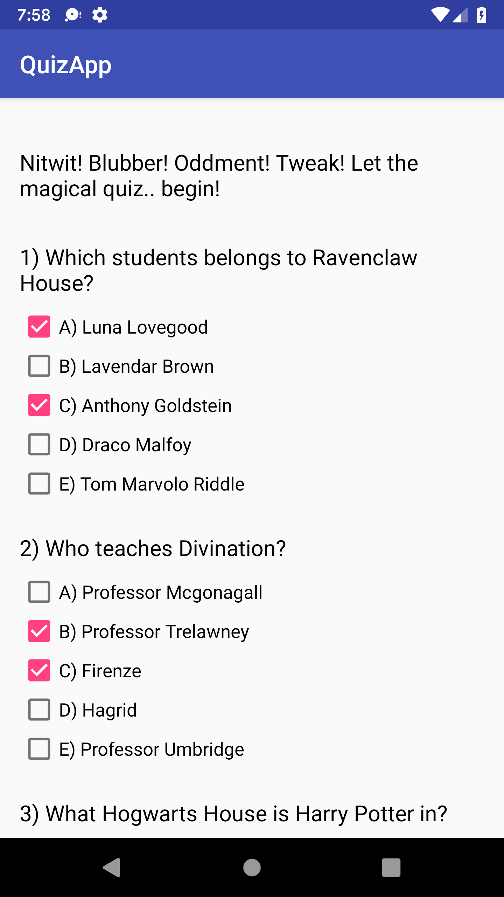
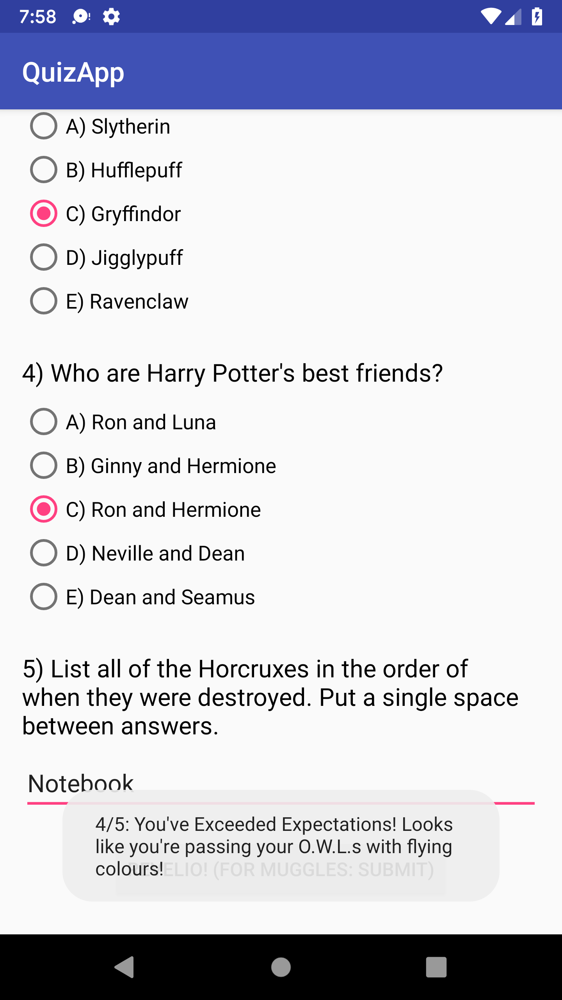

# Udacity Android Basics Nanodegree - QuizApp
This repository contains the QuizApp app from Udacity's User Input course. This app is created using Android Studio and developed in Java. The layout was designed in an XML document using a combination of a ScrollView, a LinearLayout, Textviews, Checkboxes, RadioGroups, RadioButtons, EditTexts, and Buttons. When the user submits their answers, a toast pops up to let the user know their score.

## Overview
QuizApp is an fun and educational quiz app that tests the user's knowledge on the Harry Potter universe. The user can interactively answer the five questions, and when submitted, the user will be told their score.

 
